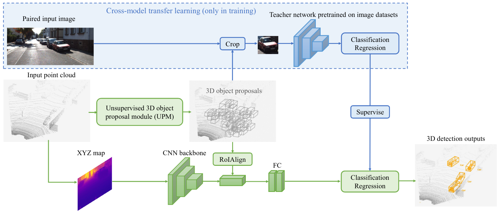
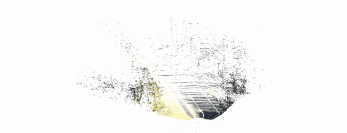

## Weakly Supervised 3D Object Detection from Point Clouds (VS3D)




#### Created by [Zengyi Qin](http://www.qinzy.tech/), Jinglu Wang and Yan Lu. The repository contains an implementation of this [ACM MM 2020 Paper](https://arxiv.org/abs/2007.13970). Readers are strongly recommended to create and enter a [virtual environment](https://docs.conda.io/projects/conda/en/latest/user-guide/tasks/manage-environments.html) with Python 3.6 before running the code.

### Quick Demo with Jupyter Notebook
Clone this repository:
```bash
git clone https://github.com/Zengyi-Qin/Weakly-Supervised-3D-Object-Detection.git
```
Enter the main folder and run installation:
```bash
pip install -r requirements.txt
```
Download the [demo data](https://drive.google.com/file/d/1s4G3avlud7H4oqEBpi0GMnL20HjPJ9Wd/view?usp=sharing) to the main folder and run `unzip vs3d_demo.zip`. Readers can try out the quick demo with Jupyter Notebook:
```bash
cd core
jupyter notebook demo.ipynb
```

### Training
Download the [Kitti Object Detection Dataset](http://www.cvlibs.net/datasets/kitti/eval_object.php?obj_benchmark=3d) ([image](http://www.cvlibs.net/download.php?file=data_object_image_2.zip), [calib](http://www.cvlibs.net/download.php?file=data_object_calib.zip) and [label](http://www.cvlibs.net/download.php?file=data_object_label_2.zip)) and place them into `data/kitti`. Download the ground planes and front-view XYZ maps from [here](https://drive.google.com/file/d/1SGgIFLK8t7IVf6Cb_yk83NGWzJcx5WwK/view?usp=sharing) and run `unzip vs3d_train.zip`. Download the pretrained teacher network from [here](https://drive.google.com/file/d/1rnTjOg7R8Ino6778OPTxJSvHBzuc50Yv/view?usp=sharing) and run `unzip vs3d_pretrained.zip`. The data folder should be in the following structure:
```
├── data
│   ├── demo
│   └── kitti
│       └── training
│           ├── calib
│           ├── image_2
│           ├── label_2
│           ├── sphere
│           ├── planes
│           └── velodyne
│       ├── train.txt
│       └── val.txt
│   └── pretrained
│       ├── student
│       └── teacher
```
The `sphere` folder contains the front-view XYZ maps converted from `velodyne` point clouds using the script in `./preprocess/sphere_map.py`. After data preparation, readers can train VS3D from scratch by running:
```bash
cd core
python main.py --mode train --gpu GPU_ID
```
The models are saved in `./core/runs/weights` during training. Reader can refer to `./core/main.py` for other options in training.

### Inference
Readers can run the inference on KITTI validation set by running:
```bash
cd core
python main.py --mode evaluate --gpu GPU_ID --student_model SAVED_MODEL
```
Readers can also directly use the pretrained model for inference by passing `--student_model ../data/pretrained/student/model_lidar_158000`. Predicted 3D bounding boxes are saved in `./output/bbox` in KITTI format. 

### Citation
```
@article{qin2020vs3d, 
  title={Weakly Supervised 3D Object Detection from Point Clouds}, 
  author={Zengyi Qin and Jinglu Wang and Yan Lu},
  journal={ACM Multimedia},
  year={2020}
}
```
